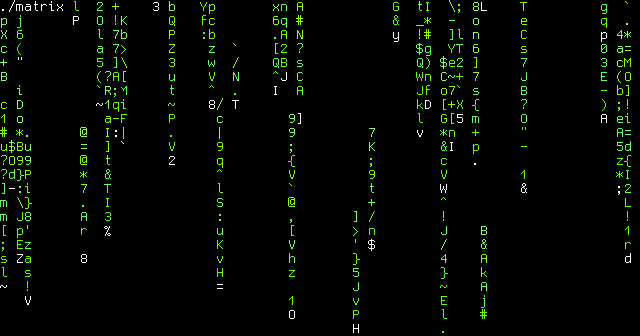

# matrix.py
The terminal screensaver you've wanted since 1999

## Install
`wget https://raw.githubusercontent.com/illinoisjackson/matrix.py/master/matrix -P /usr/bin`
## Arguments
```
usage: matrix [-h] [-d DELAY] [-n FADES] [-miln MINLENGTH] [-mxln MAXLENGTH]
              [-mis MINSPEED] [-mxs MAXSPEED] [-milt MINLIFETIME]
              [-mxlt MAXLIFETIME] [-c COLORS] [-cc HEADCOLOR] [-C CHARS] [-g]
              [-t]

A cool matrix effect for your terminal!

optional arguments:
  -h, --help            show this help message and exit
  -d DELAY, --delay DELAY
                        set delay between frames in seconds (default 0.1)
  -n FADES, --fades FADES
                        set number of "fades" on screen (default 25)
  -miln MINLENGTH, --minlength MINLENGTH
                        set minimum length of fades (default 4)
  -mxln MAXLENGTH, --maxlength MAXLENGTH
                        set maximum length of fades (default 20)
  -mis MINSPEED, --minspeed MINSPEED
                        set minimum speed of fades (default 0.5)
  -mxs MAXSPEED, --maxspeed MAXSPEED
                        set maximum speed of fades (default 2)
  -milt MINLIFETIME, --minlifetime MINLIFETIME
                        set minimum lifetime of fades (default 10)
  -mxlt MAXLIFETIME, --maxlifetime MAXLIFETIME
                        set maximum lifetime of fades (default 30)
  -c COLORS, --colors COLORS
                        set fade colors. Must be a comma separated list of
                        values on the terminal's color palette. (default
                        83,84,119,120)
  -cc HEADCOLOR, --headcolor HEADCOLOR
                        set fade head color. (default 16)
  -C CHARS, --chars CHARS
                        set fade characters. Is a comma separated list of
                        unicode ranges. Can be one character or a range.
                        [Example: -C 32-55,66,2605,2606,6785-8941] (default
                        32-128)
  -g, --debug           show debug statistics in upper left corner
  -t, --colortest       output a color test screen
  ```
